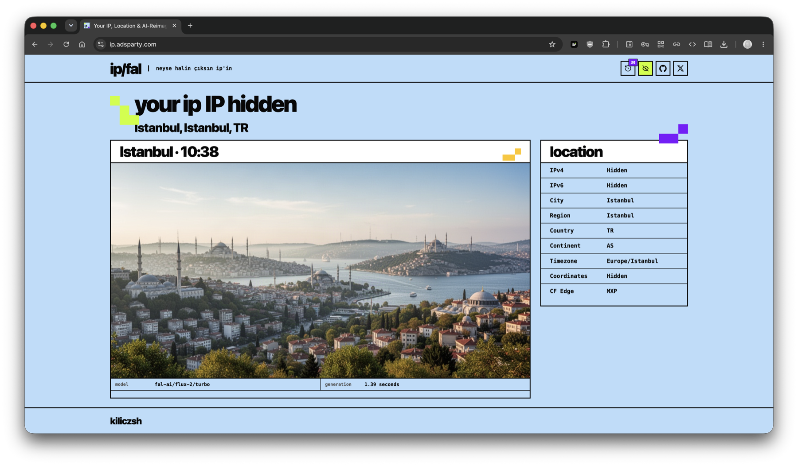

# ip/fal — neyse halin çıksın ip'in

An open-source, geo-aware IP page powered by Cloudflare Workers and fal.ai.
Each visitor sees the public IP used for the current connection, Cloudflare's
approximate location metadata, and an AI-generated view informed by local place,
season, and time.

Production example: <https://ip.adsparty.com>

[](https://ip.adsparty.com)

## Features

- Cloudflare edge geolocation with no separate geolocation database
- Location- and time-aware fal.ai image generation
- Responsive 16:9 desktop and 9:16 mobile images
- Edge caching in 15-minute location/time buckets
- Per-IP generation rate limiting and short-lived signed requests
- Client-side visit history stored only in the visitor's browser
- Privacy mode for screenshots
- Credit-free local previews with five location fixtures

## Project structure

```text
.
├── .github/                 GitHub Actions and contribution templates
├── docs/assets/             Documentation images
├── fixtures/locations/      Simulated Cloudflare request profiles
├── scripts/                 Local developer tools
├── src/
│   ├── assets/              Generated static assets
│   ├── page.ts              Server-rendered HTML, CSS, and browser behavior
│   └── worker.ts            Worker routes, security, cache, and fal.ai calls
├── tests/                   Unit tests
├── wrangler.jsonc           Safe default configuration for forks
└── wrangler.production.example.jsonc
```

## Requirements

- Node.js 20 or newer
- A Cloudflare account
- A fal.ai API key for real image generation

## Quick start

```sh
npm install
cp .dev.vars.example .dev.vars
npm run preview -- istanbul
```

Open <http://127.0.0.1:8787>. Mock preview mode never calls fal.ai and does not
consume credits.

Available fixtures: `istanbul`, `tokyo`, `new-york`, `sydney`, and `reykjavik`.

Run a fixture with real fal.ai generation:

```sh
npm run preview -- tokyo --live
```

This requires `FAL_KEY` in `.dev.vars`.

## Configuration

Public configuration lives in `wrangler.jsonc`:

| Variable | Required | Purpose |
| --- | --- | --- |
| `FAL_MODEL_ID` | No | fal.ai model; defaults to `fal-ai/flux-2/turbo` |
| `APP_HOST` | Production | Restricts generation to the configured hostname |
| `WEB_ANALYTICS_TOKEN` | No | Enables Cloudflare Web Analytics |

Secrets must never be committed:

| Secret | Purpose |
| --- | --- |
| `FAL_KEY` | Server-side fal.ai credentials |
| `GENERATION_SIGNING_KEY` | Signs short-lived, IP-bound generation tokens |

## Checks

```sh
npm run typecheck
npm test
npm run check
```

`npm run check` runs TypeScript, unit tests, and a Wrangler dry run. The same
command runs in GitHub Actions for pushes and pull requests.

## Deploy

The default configuration deploys to a personal `workers.dev` hostname:

```sh
npx wrangler secret put FAL_KEY
npx wrangler secret put GENERATION_SIGNING_KEY
npm run deploy
```

For a custom domain, create an ignored maintainer configuration:

```sh
cp wrangler.production.example.jsonc wrangler.production.jsonc
```

Update its account ID, Worker name, custom domain, `APP_HOST`, and rate-limit
namespace, then add secrets and deploy:

```sh
npx wrangler secret put FAL_KEY --config wrangler.production.jsonc
npx wrangler secret put GENERATION_SIGNING_KEY --config wrangler.production.jsonc
npm run deploy:production
```

## Security and privacy

`GET /geo-image-data` accepts only requests carrying a short-lived HMAC token
issued by the page and bound to the connecting IP. Same-origin checks, hostname
restriction, edge caching, and a Cloudflare rate-limit binding reduce blind
hotlinking and unexpected fal.ai spend. This is cost control, not authentication.

Visit history stays in `localStorage`; IP addresses are deliberately excluded.
Cloudflare provides only the IP family used for the current HTTP connection, so
the other family may display as not detected.

See [SECURITY.md](SECURITY.md) for responsible disclosure.

## Contributing

Contributions are welcome. Read [CONTRIBUTING.md](CONTRIBUTING.md) before opening
a pull request.

## License

[MIT](LICENSE)
